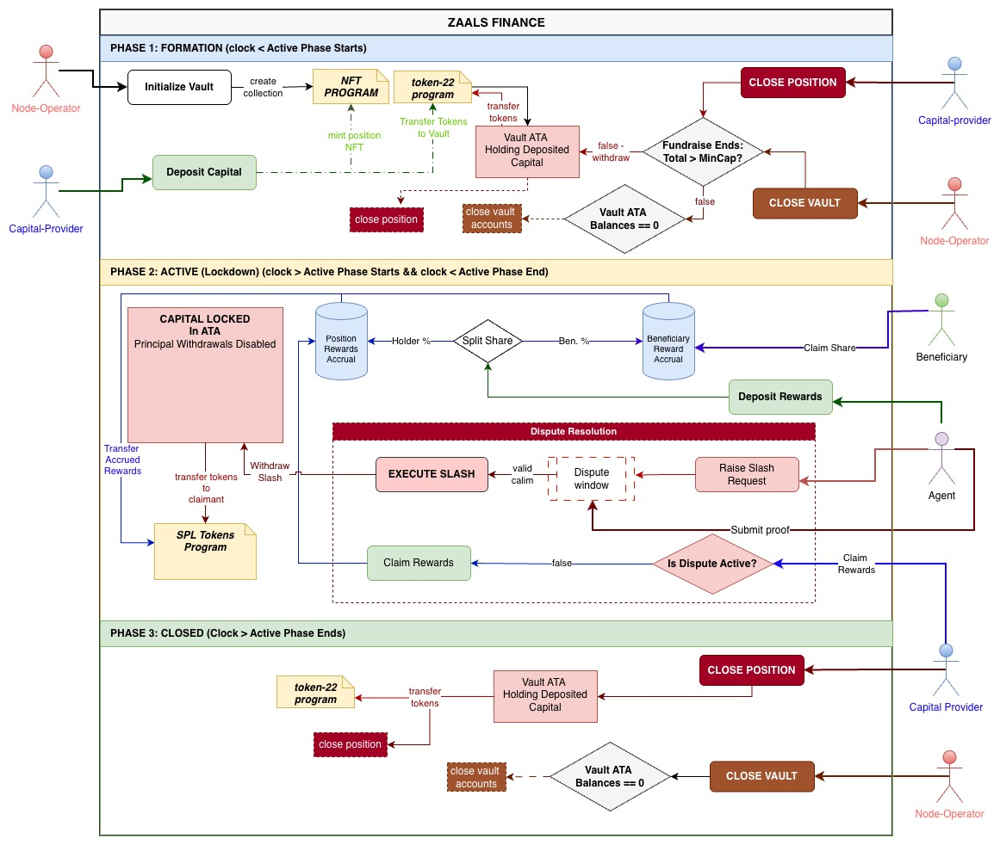

# **Zaals Finance**

### Capital Coordination Protocol for DePIN on Solana

---

## 🌟 Overview

**Zaals Finance** is a decentralized protocol designed to coordinate capital between Node Operators and Capital Providers in DePIN ecosystems using NFT-backed positions and programmable vaults on the Solana blockchain.

The protocol allows a node operator to create a revenue-sharing vault, attract capital from multiple providers, distribute token rewards, manage disputes, and enforce slashing – all through transparent on-chain logic.

Every deposit position is represented by a unique NFT, making ownership transferable while the underlying capital remains securely locked in a PDA vault.

---

## 🎯 What Problem This Solves

Traditional funding models for decentralized infrastructure suffer from poor coordination, lack of transparency, and rigid ownership structures.

Zaals Finance introduces:

* Trustless capital formation
* Automated reward sharing
* Performance-based slashing
* NFT-transferable positions
* Clear phase-based fund locking

This creates an intuitive middle layer where capital can support real network activity without relying on centralized intermediaries.

---

## 🧩 Core Concepts

* **Vault** – Program Derived Account holding locked capital and rewards
* **Position NFT** – Represents each capital provider’s stake
* **Beneficiaries** – Off-chain entities entitled to reward share
* **Agent** – Dispute and slashing enforcer
* **Reward Distributor** – Authorized wallet for depositing rewards

---

## 🏗 Actors

The protocol revolves around five major actors:

1. **Node Operator**
   Creates and manages vault configurations.

2. **Capital Provider**
   Deposits capital and earns pro-rata rewards.

3. **Position Holder**
   The current owner of a Position NFT.

4. **Agent**
   Monitors node performance and raises slashing disputes.

5. **Beneficiary**
   Receives predefined share of vault rewards.

---

## 🔄 Protocol Phases

Zaals Finance operates through distinct lifecycle phases:

### 1. Initialization Phase

Node Operators initialize vaults with:

* Token mint for rewards
* Minimum and Maximum capital limits
* Investor reward BPS
* Beneficiary addresses and shares
* Slashing constraints

During this phase:

* Vaults are validated for correct share totals
* Mismatched caps or invalid shares cause failure
* A new **MPL-Core Collection** NFT is created
* Capital formation period begins

---

### 2. Capital Formation Phase

Capital Providers can:

* Deposit capital into vault
* Receive minted Position NFTs
* Withdraw early before activation
* Exit if minimum cap isn’t reached

Key behaviors:

* Deposits after activation are rejected
* Early withdrawals burn NFTs
* Withdrawals after active phase are locked
* Node Operators can close unformed vaults if ATA is empty

---

### 3. Active Phase

Once fundraise ends and conditions are met:

* Vault enters **Active Phase**
* Capital becomes locked
* Rewards can be deposited
* Claimable rewards grow with stake
* Principal unlock attempts are rejected

NFT positions can now be:

* Listed on secondary markets
* Purchased by buyers
* Ownership transferred seamlessly

---

### 4. Reward Deposit Validation

Rewards are accepted only if:

* Sent from authorized distributor
* Match correct token mint
* Occur during Active Phase

Invalid deposits fail with appropriate errors.

---

### 5. Slashing & Dispute Window

Agents can:

* Raise slashing requests
* Open dispute windows
* Submit proofs
* Get slash approvals

Important rules:

* Requests above max BPS are rejected
* No slashing outside Active Phase
* Rewards can continue flowing during disputes
* Claims during disputes are blocked

If proof isn isn’t submitted in time:

* Slash requests are automatically dismissed

---

### 6. Closure Phase

After vault lifecycle ends:

* Position Holders can withdraw principal
* NFTs are burned upon withdrawal
* All remaining tokens must be withdrawn
* Vault PDA closes and rent SOL returns to Node Operator

---

## 🛠 Technical Implementation

The project has been implemented as a suite of Solana programs using the **Anchor Framework** and **MPL Core** standards.

### Key Technologies

* Rust
* Anchor Framework
* Anchor SPL Token Interfaces
* Codama-generated clients
* LiteSVM for testing

---

## 📁 Program Flow Architecture

The following diagram represents the end-to-end protocol flow:

---

## 📜 Key Features

* NFT-backed staking positions
* Fee-adjusted early exits
* Automated reward splits
* Beneficiary priority claims
* Dispute-resistant vault design
* Slashing with max limits
* Rent-reclaimable PDAs
